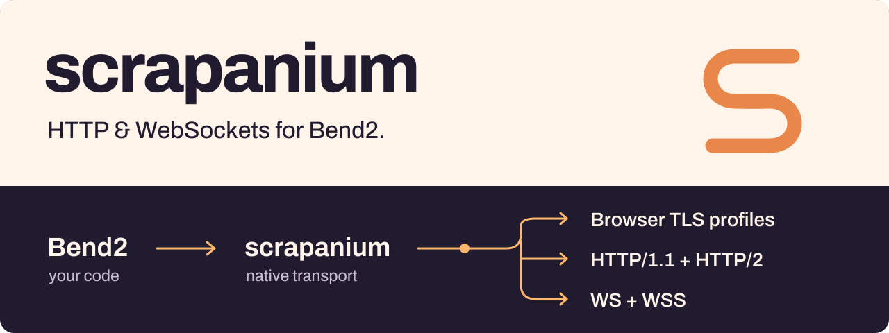

<p align="center">
  
</p>

<p align="center">
  <a href="docs/GETTING_STARTED.md"><b>Get started →</b></a> &nbsp; · &nbsp;
  <a href="docs/PROFILES.md">Browser profiles</a> &nbsp; · &nbsp;
  <a href="docs/WEBSOCKETS.md">WebSockets</a> &nbsp; · &nbsp;
  <a href="benchmarks/RESULTS.md">Benchmarks</a>
</p>

**Scrapanium is an HTTP and WebSocket library for Bend2.** Make requests, choose a browser TLS profile, and keep connections open for fast batches or real-time messages. It runs directly on curl-impersonate and BoringSSL.

### What you get

- **Browser profiles** — 41 versioned targets across Chrome, Firefox, Safari and more, plus custom TLS and HTTP/2 settings.
- **HTTP that reuses connections** — pooled sessions, concurrent batches, cookies, redirects and proxies.
- **TLS WebSockets** — text and binary messages over WS/WSS, with certificate checks, timeouts and cancellation.
- **Binary data and downloads** — uploads, response buffers and streaming to files with memory limits.

### Make a request

```bend
import Base
import ./scrapanium.bend as S

def print_body(pair: S.Response & String) -> IO(Unit):
  (response, body) = pair
  do IO<Unit>:
    IO.print(body)
    S.discard(response)

def main() -> IO(Unit):
  do IO<Unit>:
    response : S.Response <- IO.try(S.Response, S.get("https://example.com"))
    pair : S.Response & String <- S.text(response)
    print_body(pair)
```

**[Install and run your first request →](docs/GETTING_STARTED.md)**
More examples: [pooled requests](examples/get.bend) · [file downloads](examples/download.bend) · [WebSockets](docs/WEBSOCKETS.md) · [API reference](docs/API.md).

### Where it stands

| | Today |
| :--- | :--- |
| **Release** | Working alpha. The API can still change. |
| **Platform** | Linux x86_64 / WSL2 · Bend 2.0.17 · native C target. |
| **Tests** | **324 passing locally**, including **53 WS/WSS cases** and sanitizer checks. [Test details](docs/VALIDATION.md) · [CI](https://github.com/0x5f3759df-fs/scrapanium/actions/workflows/ci.yml). |
| **Profiles** | Default: Chrome 150. Firefox 148 available; Chrome 152 is a preview. **Latest-browser coverage is incomplete.** [Exact coverage](docs/PROFILES.md). |
| **Still missing** | Easy binary installs, macOS/ARM support, automatic retries, multipart uploads and WebSocket compression. |

### How fast?

In six warm, local HTTP workloads, Scrapanium measured **1.10–1.78× the throughput of curl_cffi** using the same backend. Small-message WSS was roughly equal: **5,988 vs 6,045 round trips/s**. These are loopback results, not Internet speed guarantees.

[HTTP results & methodology](benchmarks/RESULTS.md) · [WSS results](benchmarks/WEBSOCKET.md) · [Memory usage](benchmarks/MEMORY.md)

---

[MIT](LICENSE) · Built on [Bend](https://github.com/bendlang/bend) and [curl-impersonate](https://github.com/lexiforest/curl-impersonate). Tested against [curl_cffi](https://github.com/lexiforest/curl_cffi) and [tls-client](https://github.com/bogdanfinn/tls-client). [Credits & licenses](THIRD_PARTY.md).

<sub>Profile data: Bogdan Finn / tls-client. Upstream acknowledgement: “This product includes software developed by the &lt;organization&gt;.”</sub>
