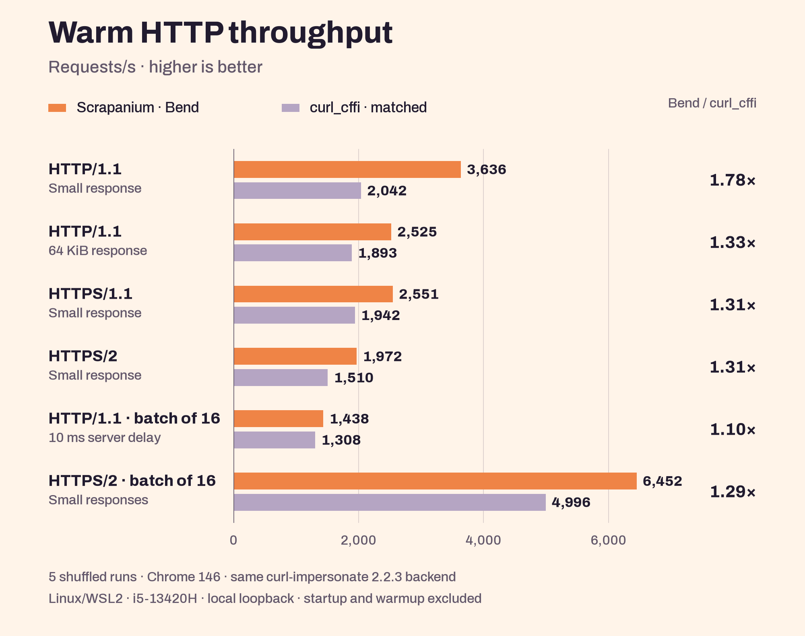
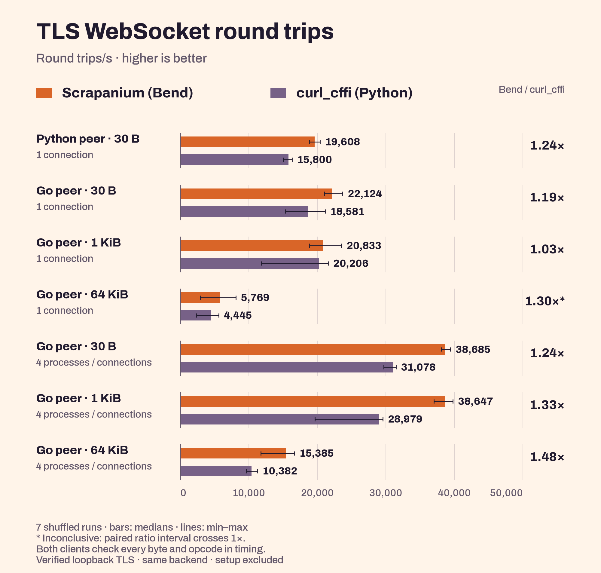
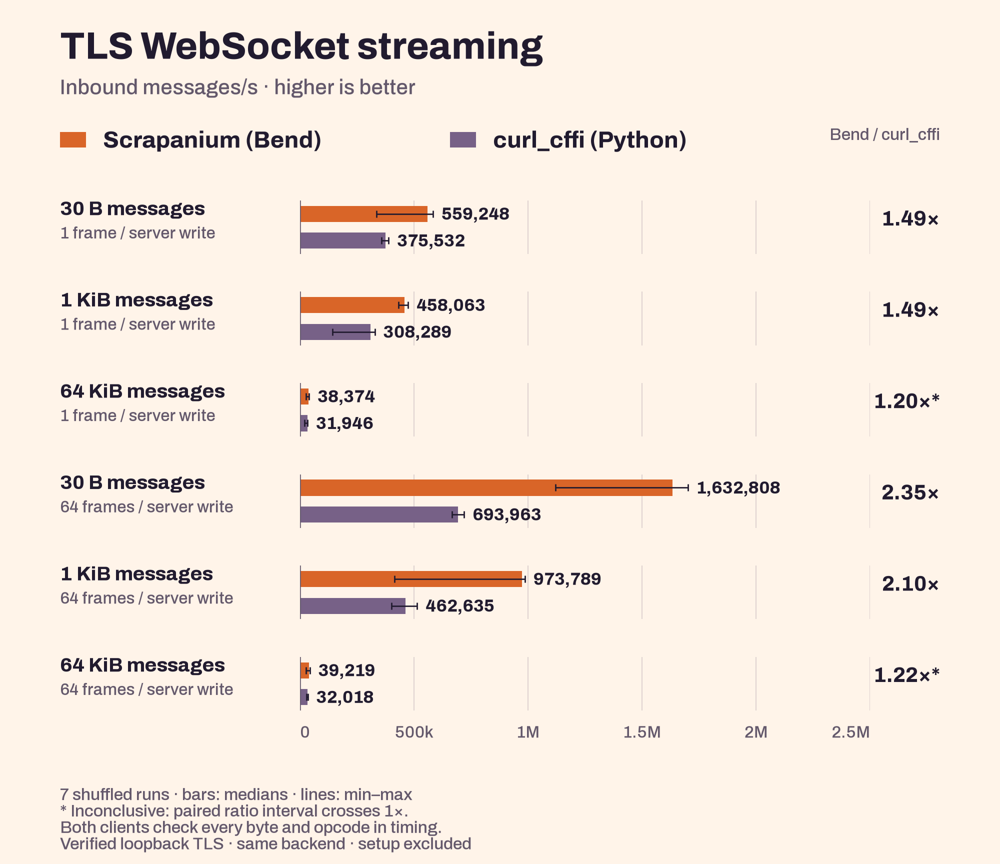
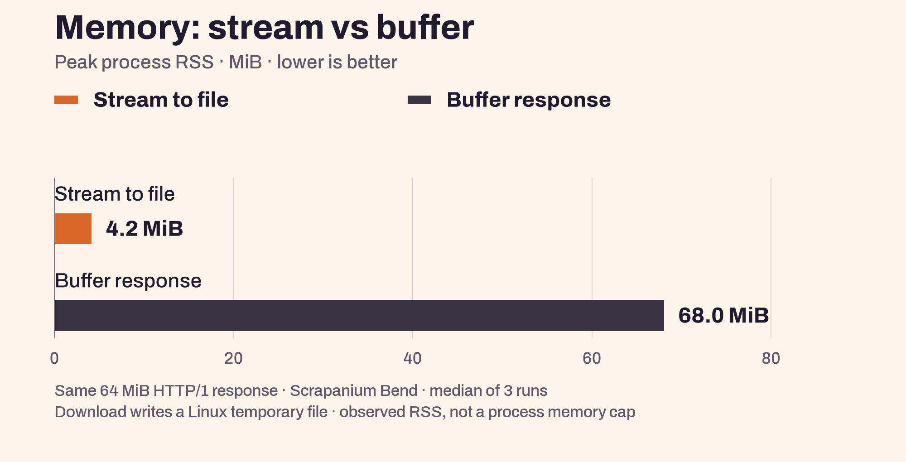

<p align="center">
  <picture>
    <source media="(max-width: 640px)" srcset="docs/assets/banner-mobile.png">
    
  </picture>
</p>

<p align="center">
  <a href="docs/GETTING_STARTED.md"><b>Get started →</b></a> &nbsp; · &nbsp;
  <a href="docs/API.md">API reference</a> &nbsp; · &nbsp;
  <a href="#performance">Benchmarks</a>
</p>

**HTTP and TLS WebSockets for Bend2.** Choose a browser TLS profile, reuse connections, and send requests or real-time messages through curl-impersonate and BoringSSL.

## What you get

- **[41 browser profiles + 5 optional targets](docs/PROFILES.md)**, including capture-tested Chrome 153/154 and Firefox 156 on Linux.
- **[HTTP/1.1 and HTTP/2](docs/REQUESTS.md)** with pooled sessions, concurrent batches, cookies, redirects and proxies.
- **[WS and WSS](docs/WEBSOCKETS.md)** for text and binary messages, with certificate verification, timeouts and cancellation.
- **[Binary data and downloads](examples/download.bend)** with uploads, response buffers and streaming to files.

## Performance

Measured through the Bend API on Linux/WSL2. **Orange: Scrapanium (Bend). Purple: curl_cffi (Python).** Both use warm connections and the same stock curl-impersonate backend. The memory chart compares two modes of Scrapanium, labeled separately.

Batched 30-byte WSS streaming: **1.63M messages/s versus 694k — 2.35× throughput.** Both clients receive 64 frames per server write on one connection and check every byte. Round-trip gains are smaller; three 64 KiB comparisons remain inconclusive.

<p>
  <picture>
    <source media="(max-width: 600px)" srcset="docs/assets/performance-http-mobile.png">
    
  </picture>
</p>

<p>
  <picture>
    <source media="(max-width: 600px)" srcset="docs/assets/performance-wss-mobile.png">
    
  </picture>
</p>

<p>
  <picture>
    <source media="(max-width: 600px)" srcset="docs/assets/performance-wss-streaming-mobile.png">
    
  </picture>
</p>

<p>
  <picture>
    <source media="(max-width: 600px)" srcset="docs/assets/performance-memory-mobile.png">
    
  </picture>
</p>

Local loopback medians, with startup and handshakes excluded from throughput. Memory is whole-process peak RSS. These measurements do not establish Internet performance or a process-wide memory bound.

[HTTP results](benchmarks/RESULTS.md) · [WSS results](benchmarks/WEBSOCKET.md) · [Memory results](benchmarks/MEMORY.md) — methodology, raw data and reproduction commands.

## Make your first request

After [installing the prerequisites and bootstrapping](docs/GETTING_STARTED.md), save this as `hello.bend` in the repository root:

```bend
import Base
import ./scrapanium.bend as S

def print_body(pair: S.Response & String) -> IO(Unit):
  (response, body) = pair
  do IO<Unit>:
    IO.print(body)
    S.discard(response)

def main() -> IO(Unit):
  do IO<Unit>:
    response : S.Response <- IO.try(S.Response, S.get("https://example.com"))
    pair : S.Response & String <- S.text(response)
    print_body(pair)
```

```sh
python3 scripts/build.py hello.bend -o build/hello
./build/hello --threads 1
```

`get` closes its session automatically; `discard` releases the response buffer. For repeated requests, keep a session open and reuse its connections.

[Pooled requests](examples/get.bend) · [File downloads](examples/download.bend) · [WebSockets](docs/WEBSOCKETS.md) · [API reference](docs/API.md)

## Current status

| | Today |
| :--- | :--- |
| **Release** | Working alpha. The API can still change. |
| **Platform** | Linux x86_64 / WSL2 · Bend 2.0.17 · native C target. |
| **Tests** | **400+ passing tests**, including WS/WSS and sanitizer checks. [Test details](docs/VALIDATION.md) · [CI](https://github.com/0x5f3759df-fs/scrapanium/actions/workflows/ci.yml). |
| **Profiles** | Default: Chrome 150. Optional Chrome 153/154 and Firefox 156 profiles have scoped Linux capture evidence. Safari 27 and wider platform coverage remain pending. [Exact coverage](docs/PROFILES.md). |
| **Still missing** | Easy binary installs, macOS/ARM support, automatic retries, multipart uploads and WebSocket compression. |

---

[MIT](LICENSE) · Built on [Bend](https://github.com/bendlang/bend) and [curl-impersonate](https://github.com/lexiforest/curl-impersonate). Tested against [curl_cffi](https://github.com/lexiforest/curl_cffi) and [tls-client](https://github.com/bogdanfinn/tls-client). [Credits & licenses](THIRD_PARTY.md).

<sub>Profile data: Bogdan Finn / tls-client. Upstream acknowledgement: “This product includes software developed by the &lt;organization&gt;.”</sub>
