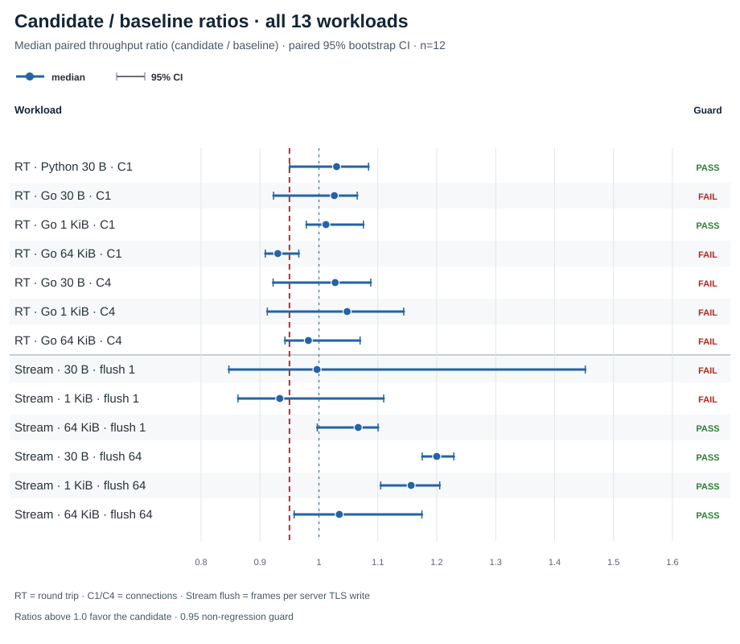
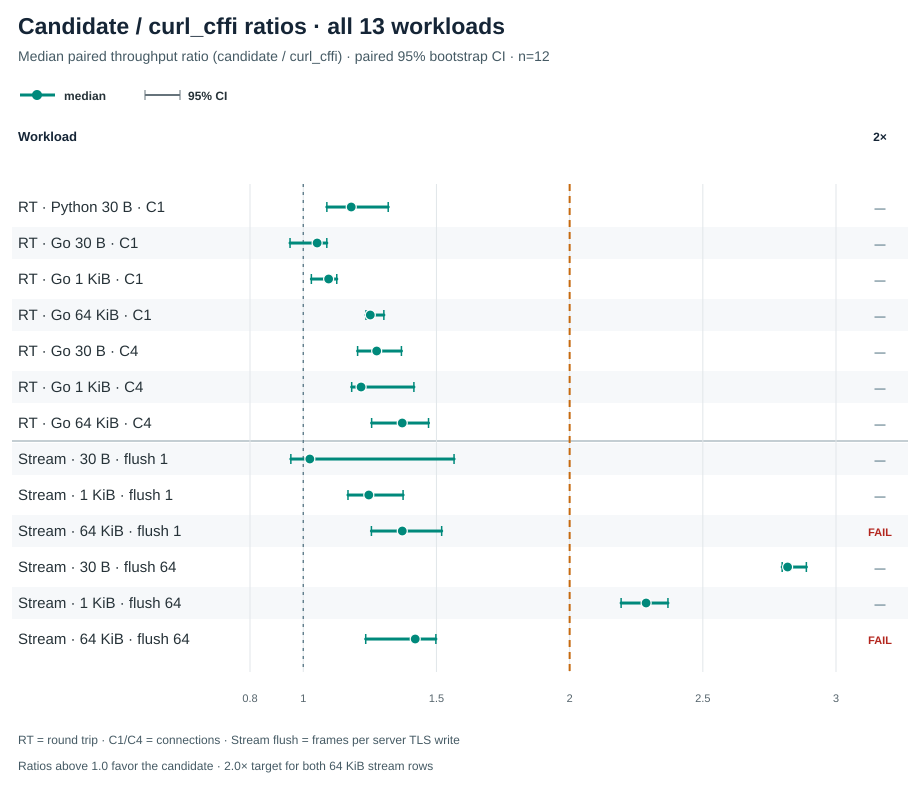

# Experimental WSS raw receive comparison

The 2026-10-06 measured comparison evaluated an experimental native receive-parser patch against a clean baseline at c4927171753a3cdcb12986f06c598219bba6e5b4, using Bend 2.0.27. It failed its predeclared performance gates: 6 of 13 workloads passed the candidate/baseline non-regression guard, and neither 64 KiB streaming workload reached the 2× candidate/curl_cffi target. The patch remains experimental and was not adopted into the product source.

The Go 64 KiB, one-connection round-trip median was 0.9302× the baseline (paired 95% CI 0.9090–0.9659), a measured 7.0% median decrease. For the two 64 KiB streaming targets, candidate/curl_cffi was 1.3718× (1.2558–1.5196) with one frame per write and 1.4203× (1.2345–1.4978) with 64 frames per write. Both intervals are below the predeclared 2× target.

<picture><source media="(max-width: 600px)" srcset="candidate-baseline-ratios-mobile.svg"></picture>

<picture><source media="(max-width: 600px)" srcset="candidate-curl-cffi-ratios-mobile.svg"></picture>

The complete summary is also available as [CSV](ratio-results.csv) and [JSON](chart-data.json); report.json retains the raw paired ratio samples.\n\nEach point is the median of 12 paired throughput ratios. The intervals resample the 12 paired observations. A guard passes only when the candidate/baseline interval lower bound is at least 0.95. A Fail label means the guard was not established; it does not by itself prove regression. Only the Go 64 KiB one-connection round-trip interval lies wholly below parity. The large-stream target passes only when the candidate/curl_cffi interval lower bound is at least 2.0.

| Workload | Candidate / baseline, median [95% CI] | Guard | Candidate / curl_cffi, median [95% CI] | 2× 64 KiB stream target |
| --- | ---: | :---: | ---: | :---: |
| RT · Python · 30 B · 1 conn | 1.0300 [0.9505, 1.0842] | Pass | 1.1801 [1.0885, 1.3189] | — |
| RT · Go · 30 B · 1 conn | 1.0262 [0.9229, 1.0650] | Fail | 1.0521 [0.9503, 1.0883] | — |
| RT · Go · 1 KiB · 1 conn | 1.0119 [0.9788, 1.0755] | Pass | 1.0952 [1.0303, 1.1257] | — |
| RT · Go · 64 KiB · 1 conn | 0.9302 [0.9090, 0.9659] | Fail | 1.2516 [1.2355, 1.3025] | — |
| RT · Go · 30 B · 4 conn | 1.0276 [0.9222, 1.0880] | Fail | 1.2756 [1.2040, 1.3685] | — |
| RT · Go · 1 KiB · 4 conn | 1.0478 [0.9124, 1.1440] | Fail | 1.2171 [1.1817, 1.4153] | — |
| RT · Go · 64 KiB · 4 conn | 0.9821 [0.9424, 1.0699] | Fail | 1.3715 [1.2566, 1.4703] | — |
| Stream · 30 B · 1 frame/write | 0.9968 [0.8472, 1.4521] | Fail | 1.0246 [0.9534, 1.5661] | — |
| Stream · 1 KiB · 1 frame/write | 0.9336 [0.8627, 1.1099] | Fail | 1.2460 [1.1679, 1.3747] | — |
| Stream · 64 KiB · 1 frame/write | 1.0667 [0.9972, 1.1005] | Pass | 1.3718 [1.2558, 1.5196] | Fail |
| Stream · 30 B · 64 frames/write | 1.2000 [1.1754, 1.2290] | Pass | 2.8183 [2.7979, 2.8887] | — |
| Stream · 1 KiB · 64 frames/write | 1.1565 [1.1049, 1.2050] | Pass | 2.2871 [2.1933, 2.3691] | — |
| Stream · 64 KiB · 64 frames/write | 1.0346 [0.9580, 1.1748] | Pass | 1.4203 [1.2345, 1.4978] | Fail |

## Campaign and provenance

The matrix covered seven round-trip workloads and six streaming workloads. Each workload ran baseline, candidate, and matched curl_cffi variants 12 times, with all six execution-order permutations balanced twice. The run retained 474 successful attempt rows: 252 round-trip, 216 streaming, and six control attempts. All six builds succeeded. Candidate and baseline source identities, binary hashes, backend mapping, peer TLS, frame accounting, and full-payload checks passed the runner validations.

The candidate source was the experimental native/websocket.inc.c patch in [experimental-native-websocket-inc.patch](../../experimental-native-websocket-inc.patch). It applies against the exact c492717 baseline file (SHA-256 0bc6766607ecfad0594d4a2df85b8247da678f4ab1cc0c9fca09504307082fb5) and produces the measured candidate source (SHA-256 0f3c4e2c2844975f4bfd63adb1ba0bfb901f6b97deff640c6a80498653ad82f8). The measured backend was the stock libcurl-impersonate.so.4.8.0 with SHA-256 bec91922e5f79213bf0e4a6dbb2b4410e6cc92cbee4a72759d6b387f14cad3e3. Bend 2.0.27 was pinned to commit 63bee70b55a71024d6bdcb49a745111bc54b114e.

The frozen protocol and runner guidance are preserved in [the comparison plan](../../README.md). The comparison runner and its focused tests are retained as [run_comparison.py](../../run_comparison.py) and [test_run_comparison.py](../../test_run_comparison.py). The raw records are in [attempts.jsonl](attempts.jsonl), [status.json](status.json), [manifest.json](manifest.json), and [report.json](report.json); all six build logs are under [build-logs](build-logs/). The manifest preserves the original absolute capture paths as provenance.

The first measured run and its tool provenance are retained in [measured-01](../measured-01/README.md). It stopped with 296 attempt rows, 295 successful and one RuntimeError: transport failed, and produced no final report. Its original cause remains unknown. A later natural-peer diagnostic received 1,001 exact frames successfully; an intentional six-second delay control produced a peer timeout after about 4.005 seconds. That control shows how a delay can trigger the generic transport error, but it does not establish the cause of the earlier failure. See the reviewed [diagnostic note](../diagnostics/diagnostic-note-20261006.md) and retained [natural](../diagnostics/natural/) and [delay-control](../diagnostics/delay-control/) records.

The full measured-02 matrix and its checksums are preserved in this package. The package-level [SHA256SUMS](../../SHA256SUMS) covers the runner, frozen plan, patch, charts, chart data, and retained evidence. The package contains text and JSON evidence, SVG charts, and source; it contains no client executables, generated C, private keys, dependency packages, or backend DSO.

## Reproduction

Create two independent clean checkouts at c492717. Leave one pristine as the baseline; apply the experimental patch to the other, which is the candidate. Copy this package directory into the patched candidate checkout at benchmarks/websocket_raw_receive_comparison/. Use the compiler and backend versions and hashes in the measured manifest, a fresh output directory, and the frozen commands and environment requirements in [the comparison plan](../../README.md). The pinned backend is not included. Every rerun must use a new output path.

The measured comparison ran on one Linux/WSL2 loopback environment. It does not establish public Internet performance or general performance across other backends, platforms, or compiler versions. The existing repository performance charts remain the separately dated Bend 2.0.17 results.
