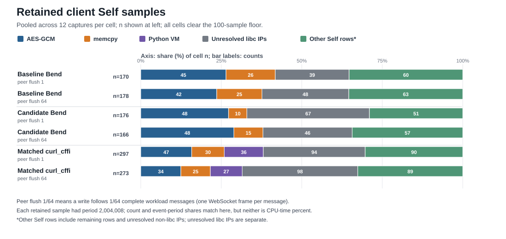

# WSS receive diagnostic results

This fixed diagnostic measures the experimental raw-receive parser on a 64 MiB loopback workload. It adds correctness, phase, peer-profile, and sampled Self evidence; it does not revise the failed predeclared 13-workload gates in the [measured-02 comparison](../measured-02/README.md). The parser remains experimental and unadopted.

This report analyzes the completed, fixed campaigns. The product source and dependency pins remain unchanged.

## Provenance and completeness

The shared diagnostic source closure remained at SHA-256 `5c6a497784847ff4cf2efd516e241785862bc49c4ec0703cc04cb8f06572a83f` during both campaigns. The exact 37-file snapshot and its pre-run plan are preserved in [source-snapshot](source-snapshot/); completed campaign status is recorded in the output manifests below.

- Primary run: [primary manifest](primary-20261007-01/manifest.json) and [samples.jsonl](primary-20261007-01/samples.jsonl). Manifest SHA-256: `2583a110edc073ae7803efe82b5f64dd27d41292093e38b7f62f44d3f3402f8e`. It completed 144 positive measurements and 24 negative correctness controls. All 144 positive cases validated 1,024 messages × 65,536 payload bytes; source, compiler, binding, and mapped curl DSO checks passed.
- Profile run: [campaign status](profile-campaign-20261007-01/campaign_status.json) and [results.jsonl](profile-campaign-20261007-01/results.jsonl). It completed the fixed 72 captures: six client/flush cells, 12 captures per cell, with no retry or extension. Every capture validated 1,024 messages, 67,108,864 payload bytes, TLS 1.3, the pinned stock curl DSO, source/build checks, and 0 lost or out-of-window samples. All six cells exceeded the preregistered 100-sample floor.

The profile analysis used pinned perf 7.0.14 on saved `perf.data` files, with `perf report --no-children -g none --show-total-period -F period,sample,comm,dso,symbol`. These are Self leaf samples: each sampled instruction address is charged to its own row, with no callchain children. All 1,260 samples had period 2,004,008 and the per-capture sample counts and period sums reconcile. Sample shares and event-period shares therefore have the same numeric values in this run, but neither is an exact CPU-time fraction. Unresolved addresses remain unresolved.

## Self sample distribution

<picture>
  <source media="(max-width: 640px)" srcset="assets/self-leaf-distribution-mobile.svg">
  
</picture>

Numbers inside the bars are sample counts; the horizontal axis is the percent of each cell total. Each cell combines 12 captures and cleared the 100-sample floor (166–297 samples). Peer flush 1/64 means a write follows 1/64 complete workload messages, one WebSocket frame per message. Every retained sample had period 2,004,008, so count and event-period shares match; neither is CPU-time percent. “Other Self rows” includes every remaining row, including unresolved non-libc IPs; unresolved libc IPs are shown separately and no symbols were guessed.

## Exclusive Self leaves

Values are pooled per cell. Shares are within-cell retained sample count / event-period share, not wall time or a CPU-time claim. “Unresolved libc IPs” retains rows reported as `libc.so.6:0x...`; no symbol guesses were made.

| Client and flush | Samples; total period | AES-GCM leaf | memcpy leaf | Additional highlighted leaf | Unresolved libc IPs |
| --- | ---: | ---: | ---: | ---: | ---: |
| Baseline Bend, 1 | 170; 340,681,360 | 45 / 90,180,360 (26.47%) | 26 / 52,104,208 (15.29%) | — | 39 / 78,156,312 (22.94%) |
| Baseline Bend, 64 | 178; 356,713,424 | 42 / 84,168,336 (23.60%) | 25 / 50,100,200 (14.04%) | — | 48 / 96,192,384 (26.97%) |
| Candidate Bend, 1 | 176; 352,705,408 | 48 / 96,192,384 (27.27%) | 10 / 20,040,080 (5.68%) | — | 67 / 134,268,536 (38.07%) |
| Candidate Bend, 64 | 166; 332,665,328 | 48 / 96,192,384 (28.92%) | 15 / 30,060,120 (9.04%) | — | 46 / 92,184,368 (27.71%) |
| Matched curl_cffi, 1 | 297; 595,190,376 | 47 / 94,188,376 (15.82%) | 30 / 60,120,240 (10.10%) | Python `_PyEval_EvalFrameDefault`: 36 / 72,144,288 (12.12%) | 94 / 188,376,752 (31.65%) |
| Matched curl_cffi, 64 | 273; 547,094,184 | 34 / 68,136,272 (12.45%) | 25 / 50,100,200 (9.16%) | Python `_PyEval_EvalFrameDefault`: 27 / 54,108,216 (9.89%) | 98 / 196,392,784 (35.90%) |

The table lists the highlighted Self rows only; an em dash means no additional row was highlighted here, not that other Self rows are zero. Among identified Bend-client leaves, libcurl's AES-GCM routine is the largest row in every cell. The compiled benchmark-client DSO itself supplied 12/170, 8/178, 5/176, and 14/166 Self samples for baseline-flush1, baseline-flush64, candidate-flush1, and candidate-flush64, respectively: 39/690 (5.65%) overall, at most 8.43% in a cell. The corresponding Self periods are 24,048,096; 16,032,064; 10,020,040; and 28,056,112. Those hits are scattered over generated `WL_FID_*` frames and a few `sp_*`/`io_*` symbols; no one such symbol exceeded four samples. This is sparse sampled evidence, not proof that parser work is zero. The large unresolved libc share also prevents a defensible parser ceiling or Amdahl bound.

The independent peer Go CPU profile had 2,155 samples, of which 615 carried workload labels and 1,540 were unlabeled. The four mode/flush rows per client contributed 209 baseline, 208 candidate, and 198 matched-curl_cffi labeled samples, each above the 80-sample per-variant floor. In the candidate-labeled flat table, `internal/runtime/syscall/linux.Syscall6` was about 1.04 s, AES-GCM about 0.50 s, and `runtime.memmove` about 0.34 s. These are peer-profile flat values; inclusive stack values are not summed with them, and the peer profile is not added to the client perf profile.

## Primary counters and phase timings

These are medians over 12 positive runs per row. Control-mode results omit per-call clocks; attribution mode enables extra timing around receive calls and phases, so the two modes are reported separately. Instrumented and control timings must not be pooled.

| Client / flush | Control wall / caller CPU (ms) | Control recv calls / AGAIN | Attribution wall / caller CPU (ms) | Attribution recv calls / AGAIN | recv-call CPU / wall (ms) | wait calls / wall / CPU (ms) | receive / validate-release phase (ms) | Peer CPU / TLS-write / send interval (ms) |
| --- | ---: | ---: | ---: | ---: | ---: | ---: | ---: | ---: |
| Baseline Bend / 1 | 47.857 / 44.847 | 5,165.5 / 41.5 | 42.455 / 40.679 | 5,152.5 / 28.5 | 30.232 / 31.591 | 28.5 / 1.994 / 0.246 | 36.073 / 6.036 | 34.278 / 41.001 / 41.105 |
| Baseline Bend / 64 | 41.210 / 39.207 | 5,171.5 / 47.5 | 48.099 / 43.710 | 5,140.5 / 16.5 | 31.090 / 32.613 | 16.5 / 1.158 / 0.173 | 40.048 / 6.985 | 39.666 / 46.164 / 46.193 |
| Candidate Bend / 1 | 45.464 / 39.142 | 5,169 / 45 | 43.503 / 41.370 | 5,187.5 / 63.5 | 29.671 / 31.276 | 63.5 / 2.877 / 0.418 | 36.575 / 6.176 | 36.029 / 41.831 / 41.947 |
| Candidate Bend / 64 | 38.996 / 35.242 | 4,166.5 / 50.5 | 47.110 / 41.041 | 4,144 / 28 | 28.924 / 30.144 | 28 / 2.586 / 0.385 | 39.320 / 6.691 | 40.166 / 44.851 / 44.881 |
| Matched curl_cffi / 1 | 61.788 / 56.127 | 5,160.5 / 36.5 | 53.125 / 49.541 | 5,151.5 / 27.5 | 29.747 / 31.132 | 27.5 / 0.307 / 0.075 | 47.107 / 5.213 | 33.894 / 50.065 / 50.144 |
| Matched curl_cffi / 64 | 57.251 / 53.537 | 5,154 / 30 | 50.042 / 49.920 | 5,139.5 / 15.5 | 29.001 / 30.499 | 15.5 / 0.267 / 0.055 | 44.044 / 5.356 | 35.389 / 46.882 / 46.914 |

Candidate flush-64 made about one thousand fewer `curl_easy_recv` calls than baseline or matched curl_cffi in this 64 MiB run, while its median control caller CPU was 35.242 ms versus baseline's 39.207 ms and its control wall was 38.996 ms versus 41.210 ms. Candidate flush-1 did not reduce recv-call counts relative to the other clients. This supports a call-count effect specific to the 64 KiB body path, but the observed median difference is modest compared with the original 2× target.

The attribution medians place roughly 29–31 ms of caller CPU inside measured receive calls, while phase-level receive/assembly is about 36–47 ms. Wait wall medians are about 0.27–2.88 ms. These timings overlap by design: receive-call clocks, wait wrappers, receive phase, validation, peer TLS writes, and send intervals are not additive. For all six client-by-flush cells, the paired 95% bootstrap intervals for attribution/control ratios of total wall time, caller-thread CPU, and process CPU cross 1. Median changes in wall time and AGAIN/wait counts are descriptive and do not establish a causal instrumentation shift. Raw paired observations are retained in [primary samples](primary-20261007-01/samples.jsonl). Because attribution mode includes per-call clocks that control mode omits, control results are the primary timing comparison; wait/AGAIN count differences remain descriptive. `curl_easy_recv` byte counts include WebSocket framing; `curl_ws_recv` byte counts are payload-only.

Peer process CPU medians were about 34–40 ms and the peer's TLS-write intervals about 41–50 ms for these transfers. They show substantial work on the sending side too, but run concurrently with client processing and cannot be added to the client duration or treated as a hard throughput ceiling.

## Next bounded experiment

The single evidence-backed experiment to try is a diagnostic candidate that changes only the direct body-read request cap from 16 KiB to `min(64 KiB, bytes remaining in the current frame)`, after the header bytes have been parsed. The measured flush-64 call reduction makes this a concrete test of whether fewer receive API iterations can help further. The Self profile says the likely upside is limited: identified client-code samples are sparse, while AES-GCM, memcpy, and unresolved libc addresses account for much of the sampled work. The cap experiment therefore needs to demonstrate the result; the profile alone does not predict a 2× gain.

Keep the receiver-owned response buffer contiguous and bounded by the current frame's remaining payload; do not read into the next frame. Keep the existing opcode, sequence, full-byte payload checker and independent response ownership/release path unchanged. No API or memory-ownership contract change is needed. Run the existing targeted correctness/adversarial checks and sanitizer checks on the isolated diagnostic build, then the full matched 13-workload comparison with the original checkers and toolchain. Acceptance still requires the lower confidence bound to reach 2× for both 64 KiB large-stream flush cases and every non-regression guard to remain at or above 0.95, including the original 64 KiB client-1 RT case that previously measured a 0.9302 point estimate (95% CI [0.9090, 0.9659]). If the single cap change misses either target, do not adopt it or expand into a parameter sweep from this evidence.

## Reproduction inputs

- Frozen closure SHA-256: `5c6a497784847ff4cf2efd516e241785862bc49c4ec0703cc04cb8f06572a83f`
- Primary manifest: [primary-20261007-01/manifest.json](primary-20261007-01/manifest.json) (SHA-256 `2583a110edc073ae7803efe82b5f64dd27d41292093e38b7f62f44d3f3402f8e`)
- Profile campaign status: [profile-campaign-20261007-01/campaign_status.json](profile-campaign-20261007-01/campaign_status.json) (SHA-256 `a51948233c4f0fd05e3965ac09f20f84972ed103bf7832b779923fbbd57968d1`)
- Profile results: [profile-campaign-20261007-01/results.jsonl](profile-campaign-20261007-01/results.jsonl) (SHA-256 `81b09b54a600ceaba154ac64bb8c82a2bf360f44c981073bd344d53732f88034`)
- Profile schedule: [profile-campaign-20261007-01/campaign.json](profile-campaign-20261007-01/campaign.json) (SHA-256 `ae1447ac1f79cfeb4f641da76582f9b5cfeb525ddc7157d9f8c011edbb7f3fe3`)

## Package contents and reproduction

The package retains the primary row data, the full profile schedule and all 72 per-capture raw perf reports/scripts, perf.data, Go cpu.prof files, and timing traces. The final sanitizer smoke covers 12 positive runs and 24 negative controls. ASan/UBSan instrumented both Bend variants, native code, and embedded bridges; the Bend preloaded shim used ASan, while the matched Python client and its shim were not instrumented. The smoke used the audited sanitizer source closure before later perf-only controller/shim changes; those later files are outside its sanitizer claim. Its [36-row sanitizer manifest](asan-smoke-20261007-final-01/manifest.json) accompanies the successful profiler-boundary proof ([manifest](perf-window-proof-20261007-08/manifest.json)), pinned-perf ACK probe ([manifest](perf-ack-probe-20261007-02/manifest.json)), exact source snapshot, and [proof-attempt ledger](attempt-ledger.md). The pre-run plan is unchanged; its planned/pending status reflects when it was frozen, while the manifests here record completed runs.

For reproduction, follow [the frozen diagnostic plan](source-snapshot/PLAN.md) and [source inventory](source-snapshot/SOURCE_INVENTORY.md) with the exact 37-path closure above. Keep the clean c492717 baseline and patched candidate checkouts independent; the candidate source SHA, Bend 2.0.27 compiler revision, backend DSO hash, bindings, and toolchain inputs are recorded in the campaign manifests. The earlier [measured-02 results](../measured-02/README.md) contain the original full 13-workload acceptance matrix and its pinned runtime details.

The package contains raw profiling data and source, but no compiled executables, shared libraries, dependency trees, TLS certificates, or private keys. [SHA256SUMS](SHA256SUMS) lists hashes for every other packaged file.
