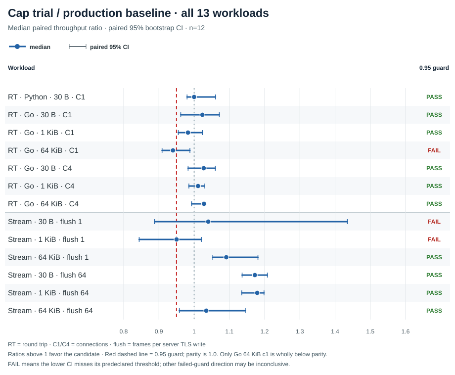
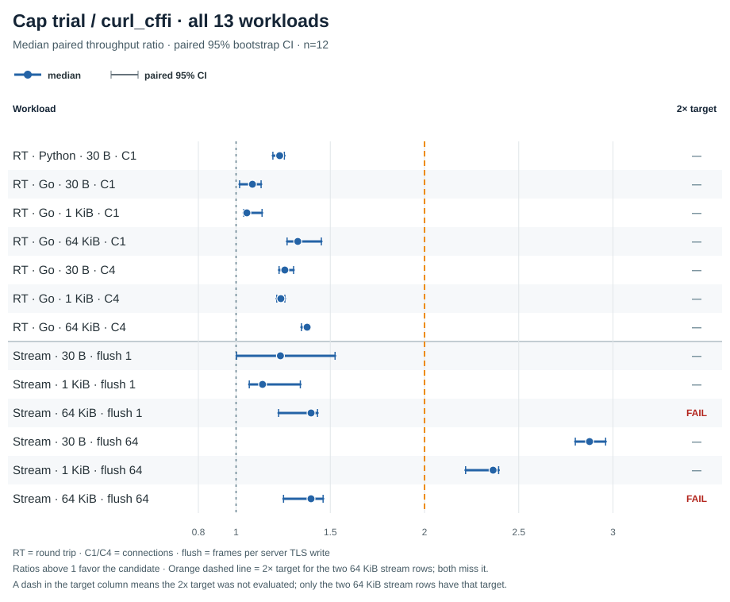

# Experimental 64 KiB WSS raw receive-cap trial

This isolated follow-up changed the maximum direct post-header read request to <code>min(frame_payload_left, 65,536)</code> on top of the previously measured raw parser. The shared 16 KiB read-ahead buffer, parser, checks, reservation, ownership and workloads stayed fixed. The trial source is SHA-256 <code>94cb08c07c1db119c43028a9b0c3682e214e205ab8550b3ba991879980cbc446</code>; its only native difference from the prior parser candidate (<code>0f3c4e2c…ad82f8</code>) is the cap expression in [the patch](provenance/cap-only-native.patch).

The candidate remained experimental and was not adopted. It passed 10 of 13 candidate/baseline guards, while both 64 KiB stream candidate/curl_cffi ratios missed the preregistered 2× target. The Go 64 KiB one-connection round trip was slower than baseline (0.9399×, 95% CI 0.9090–0.9881); this interval is wholly below parity 1.0, but crosses the 0.95 acceptance margin. The two other failed guards have intervals crossing parity, so their direction is inconclusive. A failed guard means its lower bound is below 0.95; it does not by itself establish a regression beyond that margin.

The two 64 KiB stream ratios were 1.3981× [1.2257, 1.4322] with one frame per server TLS write and 1.3978× [1.2519, 1.4619] with 64 frames per write. Neither establishes a 2× lead over matched curl_cffi. Ratios above 1 favor the cap-trial candidate.

<picture><source media="(max-width: 600px)" srcset="candidate-baseline-ratios-mobile.svg"></picture>

<picture><source media="(max-width: 600px)" srcset="candidate-curl-cffi-ratios-mobile.svg"></picture>

Each point is the median of 12 paired throughput ratios; each interval resamples the 12 matched observations. RT means round trip, C1/C4 means connection count, and stream flush means frames per server TLS write. Only the two 64 KiB stream rows have the 2× target. The plots show the parity reference separately from the 0.95 decision threshold.

| Workload | Candidate / baseline, median [95% CI] | 0.95 guard | Candidate / curl_cffi, median [95% CI] | 2× 64 KiB stream target |
| --- | ---: | :---: | ---: | :---: |
| RT · Python · 30 B · 1 conn | 1.0000 [0.9800, 1.0606] | Pass | 1.2315 [1.1954, 1.2563] | — |
| RT · Go · 30 B · 1 conn | 1.0235 [0.9621, 1.0715] | Pass | 1.0869 [1.0187, 1.1329] | — |
| RT · Go · 1 KiB · 1 conn | 0.9826 [0.9550, 1.0237] | Pass | 1.0573 [1.0407, 1.1379] | — |
| RT · Go · 64 KiB · 1 conn | 0.9399 [0.9090, 0.9881] | Fail | 1.3275 [1.2708, 1.4527] | — |
| RT · Go · 30 B · 4 conn | 1.0272 [0.9829, 1.0601] | Pass | 1.2587 [1.2283, 1.3052] | — |
| RT · Go · 1 KiB · 4 conn | 1.0111 [0.9852, 1.0287] | Pass | 1.2376 [1.2161, 1.2588] | — |
| RT · Go · 64 KiB · 4 conn | 1.0280 [0.9931, 1.0284] | Pass | 1.3771 [1.3469, 1.3870] | — |
| Stream · 30 B · flush 1 | 1.0401 [0.8877, 1.4349] | Fail | 1.2355 [1.0028, 1.5254] | — |
| Stream · 1 KiB · flush 1 | 0.9502 [0.8440, 1.0206] | Fail | 1.1404 [1.0702, 1.3410] | — |
| Stream · 64 KiB · flush 1 | 1.0913 [1.0530, 1.1811] | Pass | 1.3981 [1.2257, 1.4322] | Fail |
| Stream · 30 B · flush 64 | 1.1724 [1.1362, 1.2079] | Pass | 2.8758 [2.8002, 2.9611] | — |
| Stream · 1 KiB · flush 64 | 1.1791 [1.1353, 1.1983] | Pass | 2.3639 [2.2180, 2.3934] | — |
| Stream · 64 KiB · flush 64 | 1.0345 [0.9580, 1.1452] | Pass | 1.3978 [1.2519, 1.4619] | Fail |

The complete numeric data is available as [CSV](ratio-results.csv), [chart data](chart-data.json), and [report JSON](report.json); paired raw samples are retained in [attempts.jsonl](attempts.jsonl). The [manifest](manifest.json), [status](status.json), and six [build logs](build-logs/) retain the execution pins and build record. Independent review recomputed all 39 paired ratio vectors, medians and seeded bootstrap intervals from the attempt rows.

## Correctness and reproduction

The fixed matrix completed 474 attempts: 216 stream and 252 round-trip positives, plus six corrupt/swap controls. Every positive row retained exact payload and peer frame totals, TLS identity and mapped backend DSO checks. The run used 12 repeats, seed <code>20261007</code>, baseline commit <code>c4927171753a3cdcb12986f06c598219bba6e5b4</code>, Bend 2.0.27 commit <code>63bee70b55a71024d6bdcb49a745111bc54b114e</code>, and stock libcurl-impersonate.so.4.8.0 SHA-256 <code>bec91922e5f79213bf0e4a6dbb2b4410e6cc92cbee4a72759d6b387f14cad3e3</code>. The exact runner and its frozen README remain at [run_comparison.py](../../run_comparison.py) and [the predeclared protocol](../../README.md); the trial preregistration and validation chronology are in [provenance](provenance/).

Starting from clean c492717, [baseline-to-cap-source.patch](provenance/baseline-to-cap-source.patch) reconstructs the exact native source and lifecycle-test files used by this worktree. The earlier [experimental parser patch](../../experimental-native-websocket-inc.patch) produces the separate pre-cap candidate. To isolate the cap change, apply [cap-only-native.patch](provenance/cap-only-native.patch) to that exact source SHA <code>0f3c4e2c2844975f4bfd63adb1ba0bfb901f6b97deff640c6a80498653ad82f8</code> with <code>patch -p1</code>; the resulting native file must hash to <code>94cb08c07c1db119c43028a9b0c3682e214e205ab8550b3ba991879980cbc446</code>. The cap-specific lifecycle test delta is [cap-only-operation-reuse-test.patch](provenance/cap-only-operation-reuse-test.patch), with the resulting [C harness](provenance/cap-operation-reuse-test.c). Its Python test wrapper is preserved with its hash. These are source artifacts only; build outputs, the local dependency symlink, TLS private keys, dependency trees and the backend DSO are excluded.

The final focused ASan/UBSan lifecycle test passed once and the existing real WSS sanitizer runner passed at Bend thread counts 1 and 4. The first focused pytest collection had 133 passes and one stale-harness failure; its original stdout/stderr was not saved, and the retained partial record is explicitly incomplete. A later attempt without the matched Python package path failed before collection with <code>No module named pytest</code>; the matched-snapshot retry is the single retained lifecycle pass. See [targeted validation](provenance/targeted-validation-20261007-01.md) and [the trial addendum](provenance/trial-addendum-20261007-01.md); the failed chronology is preserved without reconstructing missing output.

The previous parser campaign remains separate: its Go 64 KiB one-connection round-trip result was 0.9302× [0.9090, 0.9659]. That record uses different native source and is not a paired comparison against this cap trial. The repository's existing Bend 2.0.17 charts remain the dated published baseline. This cap did not meet its predeclared gates and provides no basis to adopt the experimental parser or claim a large receive-path lead.

## Integrity

[SHA256SUMS](SHA256SUMS) lists every other file in this package; the checksum list itself is excluded. No benchmark executable, generated C, TLS private key, dependency package/tree or backend DSO is included.
